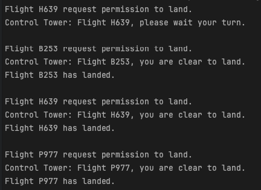

# 🛫 Mediator Pattern - Air Traffic Control Example

This project demonstrates the **Mediator Design Pattern** using a real-world analogy: **aircraft communicating through an air traffic control tower**.

## 💡 What is the Mediator Pattern?

The Mediator Pattern defines an object that encapsulates how a set of objects interact. It promotes **loose coupling** by preventing objects from referring to each other explicitly, and it allows their interaction to be **managed centrally**.

Instead of multiple components communicating directly with each other, they communicate **through a mediator**.

## ✅ Benefits

- Promotes **loose coupling** between components.
- Centralizes complex communication logic.
- Easy to extend and maintain.

## ✈️ Real-World Analogy

In real life, **aircraft do not talk directly to one another** to coordinate landings. Instead, they send requests to a **control tower**, which decides who can land and when.

This avoids confusion and ensures safe landings — exactly what the Mediator Pattern is all about.

## 🧱 Project Structure

### Interfaces

- **IAirTrafficControlMediator**
  - Defines methods for registering aircraft and handling landing requests.

### Classes

- **Aircraft (abstract)**

  - Base class for any aircraft that needs to communicate with the control tower.
- **Biplane, Helicopter, PassengerAirliner**

  - A concrete implementation of `Aircraft` that simulates a passenger aircraft.
- **AirTrafficControlMediator**

  - The central **Mediator** that handles all communication and landing coordination between aircraft.
- **Program.cs**

  - Class to run the example.

## 🧪 How It Works

1. Aircraft are created with a reference to the control tower.
2. They register themselves automatically upon creation.
3. When an aircraft wants to land, it sends a request via `RequestLanding()`.
4. The control tower decides whether the aircraft is allowed to land based on the order in the queue.

## 🖥️ Output Example

## 📂 How to Run

1. Clone the repository or copy the code into your IDE.
2. Build and run the project.
3. Observe how landing requests are handled through the mediator.

---

Happy coding! 🚀